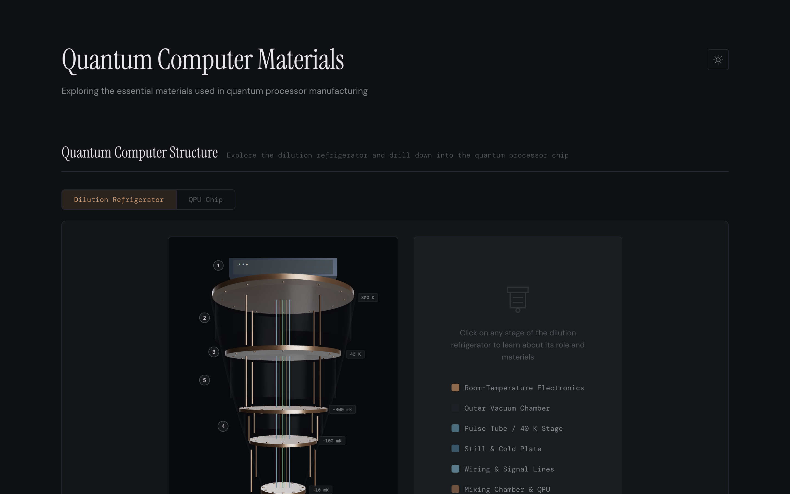
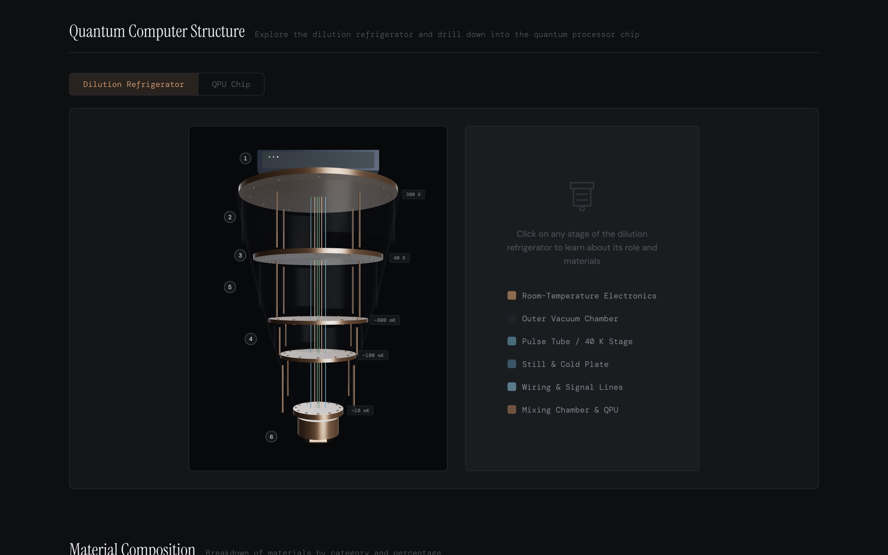
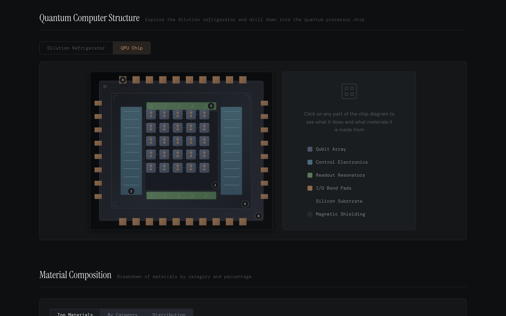
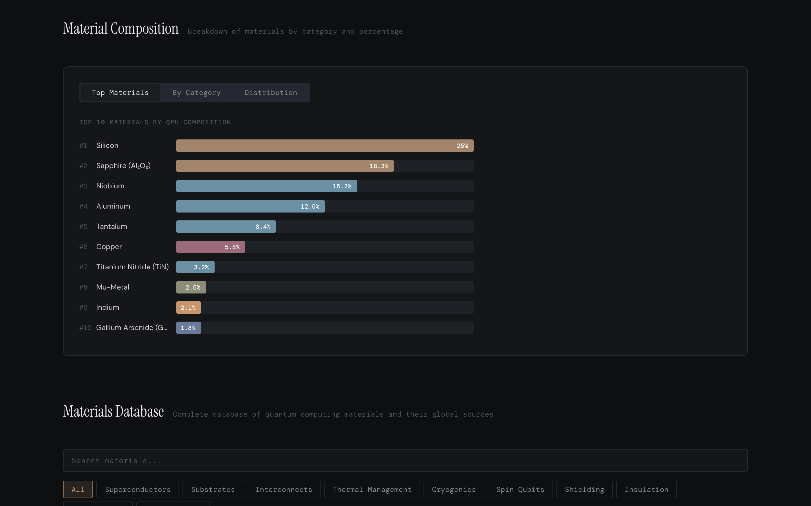
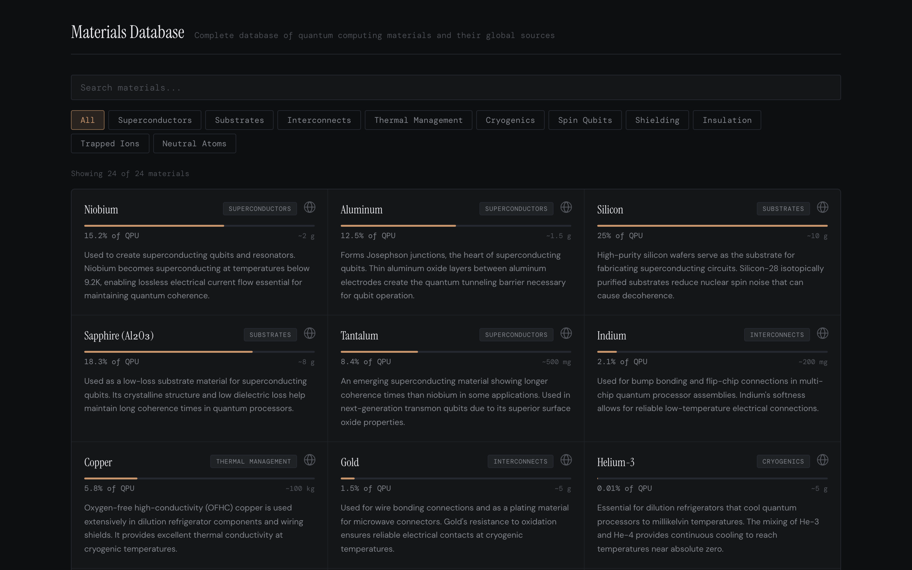
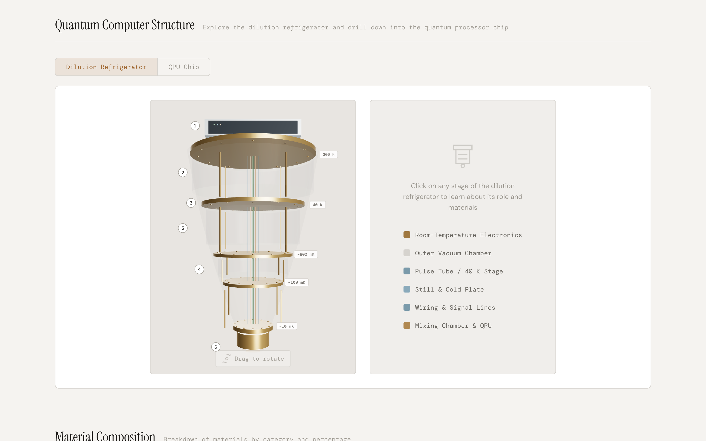

# Quantum Computer Materials

An interactive web application exploring the essential materials used in superconducting quantum processor manufacturing. Visualize the architecture of dilution refrigerators and quantum processor chips, browse a database of 24+ materials, and explore global supply chains.



## Features

### Dilution Refrigerator Visualization

Interactive 3D model of a dilution refrigerator built with Three.js. Click any of the six cooling stages (from 300 K room-temperature electronics down to the 10 mK mixing chamber) to learn about its role and constituent materials.



### QPU Chip Diagram

Interactive SVG diagram of a superconducting quantum processor with a 5x5 qubit array. Supports 3D tilt on drag. Select individual components -- qubit array, control electronics, readout resonators, I/O bond pads, silicon substrate, and magnetic shielding -- to view details.



### Material Composition Charts

Ranked bar chart of the top 10 materials by QPU composition percentage, with additional category breakdown and pie distribution views.



### Materials Database

Searchable, filterable grid of 24 quantum materials across 10 categories. Each card shows composition percentage, approximate mass, technical description, and global sourcing data with an interactive world map popup.



### Dark & Light Themes

Full theme support with automatic detection of system preference and manual toggle. Theme choice persists across sessions.



## Tech Stack

- **React 18** -- UI framework
- **Three.js** / **React Three Fiber** / **Drei** -- 3D refrigerator model with orbit controls
- **TopoJSON** -- geographic data for the supply chain world map
- **CSS custom properties** -- dark/light theming with 10-color data visualization palette
- **Google Fonts** -- DM Mono, Instrument Serif, DM Sans

## Getting Started

### Prerequisites

- Node.js v14+
- npm

### Install & Run

```bash
npm install
npm start
```

The app opens at [http://localhost:3000](http://localhost:3000).

### Production Build

```bash
npm run build
```

Output goes to the `build/` directory.

## Project Structure

```
src/
  components/
    fridge3d/          # Three.js 3D refrigerator model (11 modules)
    FridgeDiagram.js   # 2D SVG fridge diagram + info panel
    QPUDiagram.js      # Interactive QPU chip diagram
    QuantumStructure.js # View switcher (Fridge / QPU tabs)
    MaterialsList.js   # Searchable material card grid
    MaterialsChart.js  # Bar, category, and pie charts
    WorldMap.js        # Supply chain map with country data
    ThemeToggle.js     # Dark/light mode toggle
  data/
    materials.js       # 24 materials with properties and sourcing
    fridgeComponents.js # 6 fridge stages with temp ranges
  App.js               # Root layout and section navigation
```

## Material Categories

| Category | Examples |
|----------|----------|
| Superconductors | Niobium, Aluminum, Tantalum, TiN, YBCO |
| Substrates | Silicon, Sapphire |
| Interconnects | Indium, Gold |
| Thermal Management | Copper, Beryllium Copper |
| Cryogenics | Helium-3, Helium-4, NbTi |
| Shielding | Mu-Metal |
| Insulation | Kapton |
| Spin Qubits | Diamond, Germanium, GaAs, Phosphorus |
| Trapped Ions | Ytterbium, Calcium |
| Neutral Atoms | Rubidium, Strontium |

## License

This work is licensed under a [Creative Commons Attribution 4.0 International License](https://creativecommons.org/licenses/by/4.0/).

See [LICENSE](LICENSE) for the full text.
